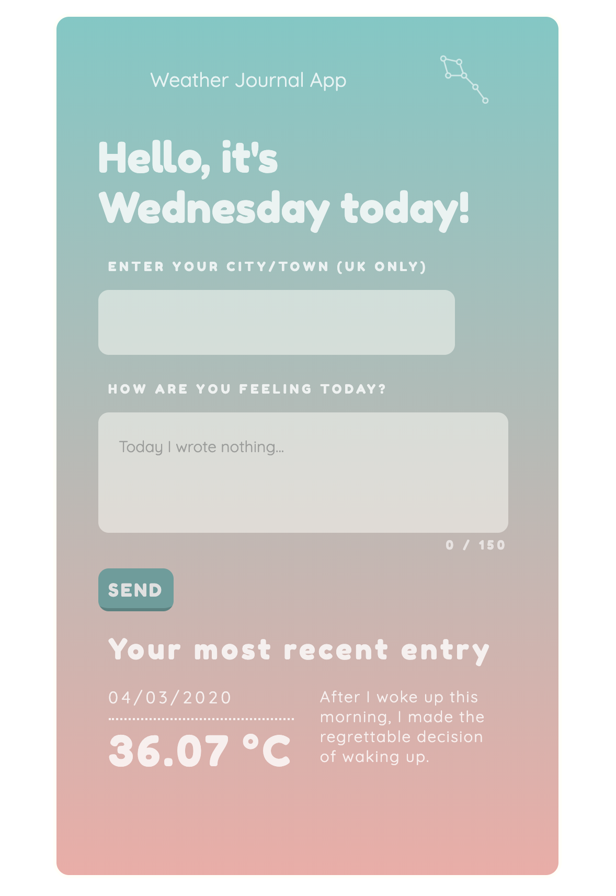

# Weather Journal App

Udacity's third project for the Front End Developer Nanodegree Program.

## ⛅ Files

The starter code is [here](https://github.com/udacity/fend/tree/refresh-2019/projects/weather-journal-app).
 
## ⛅ Submission

The project's goal was to create an asynchronous web app that uses API and user data to dynamically update the UI. To complete the project it was required to modify the `server.js` file and the `website/app.js` file. The `website/index.html` file was used for element references and the `website/style.css` file for the final design touches.



## ⛅ Required Skills & Useful Resources

* [A Beginner’s Guide to Server-Side Web Development](https://blog.bitsrc.io/a-beginners-guide-to-server-side-web-development-with-node-js-17385da09f93)
* [What is Node? What is Express?](https://developer.mozilla.org/en-US/docs/Learn/Server-side/Express_Nodejs/Introduction)
* [Node.js video tutorial for beginners](https://www.youtube.com/watch?v=TlB_eWDSMt4)
* [Why and when to use API keys?](https://cloud.google.com/endpoints/docs/openapi/when-why-api-key)
* [Anatomy of an HTTP Transaction](https://nodejs.org/en/docs/guides/anatomy-of-an-http-transaction/)
* [What is Express routing?](https://expressjs.com/en/guide/routing.html) **TLDR:** It's a respond to a client request to a particular endpoint. We define routing with a specific HTTP request method: `app.get()`, `app.post()`, etc. These functions have access to the request object `(req)` and the response object `(res)`.
* Understanding the [request object](https://alligator.io/nodejs/req-object-in-expressjs/) & the [response object](https://alligator.io/nodejs/res-object-in-expressjs/) in Express.
* [What is body-parser?](https://github.com/expressjs/body-parser) **TLDR:** It extracts the entire body portion of an incoming request stream and exposes it on `req.body`.
* [What is JSON?](https://developer.mozilla.org/en-US/docs/Learn/JavaScript/Objects/JSON)
* [JSON.parse() & JSON.stringify()](https://alligator.io/nodejs/req-object-in-expressjs/)
* [Fetch API](https://developer.mozilla.org/en-US/docs/Web/API/Fetch_API)
* [Using fetch()](https://developer.mozilla.org/en-US/docs/Web/API/Fetch_API/Using_Fetch)
* [Fetch: Cross-Origin Requests (CORS)](https://javascript.info/fetch-crossorigin)
* [CORS error and how to use CORS proxy to fix it?](https://www.freecodecamp.org/forum/t/calling-openweathermap-api-is-blocked-due-to-cors-header-access-control-allow-origin-missing/191868)
* [How does Access-Control-Allow-Origin header work?](https://stackoverflow.com/questions/10636611/how-does-access-control-allow-origin-header-work)
* [What are JavaScript Promises?](https://developer.mozilla.org/en-US/docs/Web/JavaScript/Guide/Using_promises) **TLDR:** They represent the eventual completion (or failure) of an asynchronous operation.
* [How to fix Unexpected Token in JSON error?](https://www.youtube.com/watch?v=RcEmaTVIE24)
* [Testing Node.Js/Express API with Jest and Supertest](https://www.oriechinedu.com/posts/testing-nodejs-express-api-with-jest-and-supertest)

## ⛅ Details

### Node.js and Express Environment

Firstly Node.js and Express were installed to the local machine from the command line. Then as follows:

1. The project file `server.js` requires Express:

```javascript 
const express = require('express')
```
2. An instance of the app is created with Express:

```javascript 
const app = express();
```
3. The Express app instance is pointed to the project folder with `.html`, `.css` and `.js` files:

```javascript 
app.use(express.static('website'));
```

### Project Dependencies

1. The cors package is installed, requires in the project file `server.js` and the instance of the app is setup to use `cors()`:

```javascript 
const cors = require('cors')
app.use(cors());
```

2. The `body-parser` package is installed and also included in the project:

```javascript 
const bodyParser = require('body-parser')
```

### Local Server & Endpoint

Local server is running and producing feedback to the Command Line through a working callback function. JavaScript object named `projectData` is initiated in the file `server.js` to act as the app API endpoint.

### Integrating OpenWeatherMap API

1. The base URL, personal API Key (provided by the [OpenWeatherMap API](https://openweathermap.org/guide) documentation) and a dynamic values entered by a user were saved in named `const` and `let` variables.

2. API Key is then passed as a parameter to `fetch()`.

3. Data is successfully returned from the external API.

### Return Endpoint Data: Server Side & Client Side

There is a GET route setup on the server side (route I) with: 
* the first argument as a string naming the route
* the second argument as a callback function to return the JS object created at the top of the code in the `server.js` file

There is also an asynchronous function to fetch the data from the app endpoint (route II) at the `website/app.js` file.

### POST Route

An entry can be added to the project endpoint using a POST route setup on the server side and executed on the client side as an asynchronous function. The client side function takes two arguments: 
* the URL to make a POST to
* an object holding the data to POST

The server side function creates a new entry in the app's endpoint (the named JS object) consisting of the data received from the client side POST.

### Dynamic UI

The button included in project HTML has an `addEventListener()` method called on it:
* with click as the first parameter
* a named callback function as the second parameter

The `input` element with the `placeholder` property and the `textarea` are used for the interaction. Existing DOM elements have their `innerHTML` properties dynamically set according to data returned by the app route.

## ⛅ Acknowledgments

Thanks to [FLATICON](https://www.flaticon.com/) for vector icons and to [Hover.css](https://github.com/IanLunn/Hover) for the buzzy (on hover) day of the week. 

😅
